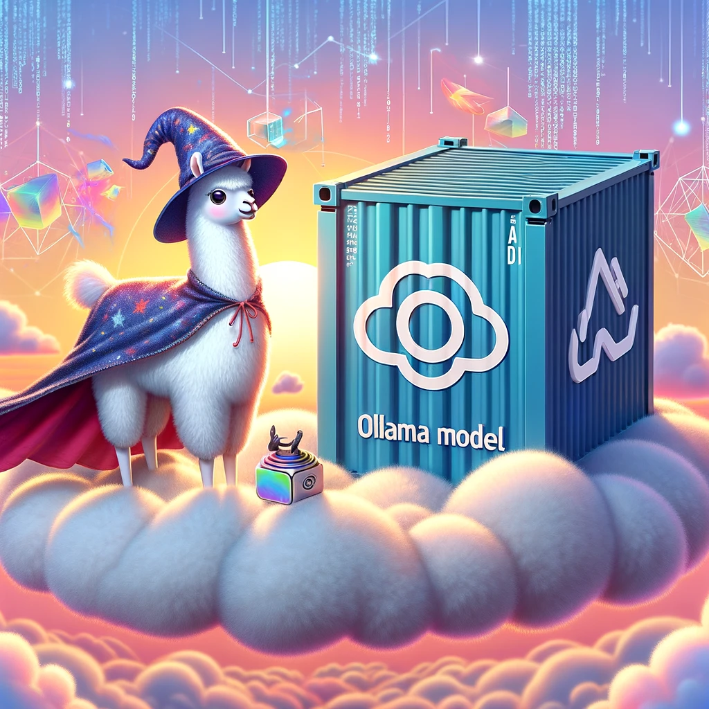

# DockLlama 🦙🐳



Welcome aboard the most exciting journey to unleash the power of Ollama models with DockLlama! If you've ever dreamed of having an open-source instance of an Ollama model at your fingertips and ready to deploy as an agnostic micro-service for any project, then pinch yourself because you're not dreaming! DockLlama is here to make that a reality. 🚀

## What's This Magic? 🌟

DockLlama is your one-stop solution to getting an open-source Ollama model instance up and running. It's like having your own AI genie, but instead of rubbing a lamp, you execute a command. Designed to serve as an agnostic micro-service, DockLlama fits into any project faster than you can say "Open Sesame!"

## Pre-requisites 📝

Before you embark on this magical journey, you'll need a few things:

### 1. Docker: Your Magic Carpet 🧞‍♂️

Ensure Docker is installed on your machine. It's the carpet that flies you to the land of DockLlama. Not sure if you have it? Run `docker --version` in your terminal. If it complains about not knowing what Docker is, follow the steps below:

- **Mac Users**: Visit [Docker for Mac](https://docs.docker.com/docker-for-mac/install/) and download the latest stable release. Follow the installation wizard to complete the setup.
- **Linux Users**: Open your terminal and paste this spell: `curl -fsSL https://get.docker.com -o get-docker.sh && sh get-docker.sh`. Voilà, Docker shall be summoned!

Remember, Docker needs at least 16GB of RAM to keep the Ollama happy. Less than that, and the Ollama might go on a strike for better working conditions. 🐑

### 2. Node.js: Your Wand 🪄

You'll also need Node.js to cast your spells. Check if you're already a wizard by running `node -v`. If you get a "spell not found" error, head over to [Node.js Download](https://nodejs.org/en/download/) and choose the version that suits your magical realm (Mac or Linux).

## Summoning the DockLlama 🦙

To summon the DockLlama, you need to add the right model you wish to use in the `.env` file. Set the `MODEL` environment variable to the desired model. You can find a list of available models [here](https://ollama.com/library).

With your magic carpet and wand ready, it's time to summon the DockLlama:

```bash
npm run docker
```

This incantation builds the DockLlama image and sets it afloat in the sea of your local machine, ready to grant your AI wishes.

## Testing Your Magic 🧪

Wondering if your DockLlama is ready to serve? Cast this spell:

```bash
curl -X POST -H "Content-Type: application/json" -d '{"message": "What you want to tell to your brand new AI"}' http://localhost:3000/chat
```

Replace `"What you want to tell to your brand new AI"` with whatever you wish to tell your DockLlama. If everything's set up correctly, you'll see it respond. If not, make sure you've followed all the steps above without skipping any magical runes. 📜

## Wrapping Up 🎁

Congratulations! You're now the proud summoner of a DockLlama. This powerful ally is ready to serve you tirelessly, asking for nothing but some electricity and a bit of your CPU time in return. Isn't that magical?

Remember, with great power comes great responsibility. Use your DockLlama wisely, and may your projects flourish with the power of AI. 🌈

## Having Issues? 🐞

Stuck in a magical mishap? Don't panic! Check the ancient scrolls (a.k.a. GitHub Issues) or summon help from fellow wizards (a.k.a. Discussions). Your journey is supported by a community of magicians just like you!

---

DockLlama: Bringing the magic of Ollama models to your fingertips, one Docker container at a time. Happy coding, and may your code run bug-free! 🦙✨
